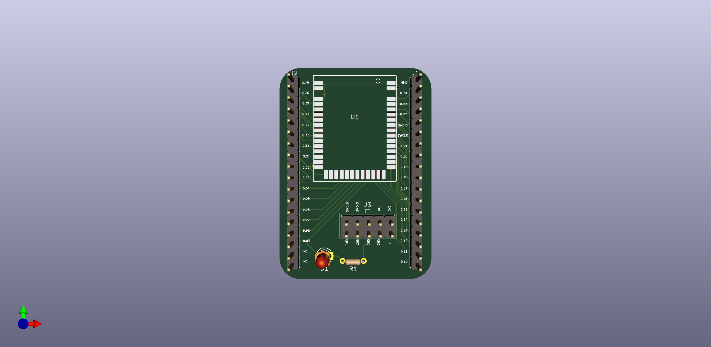
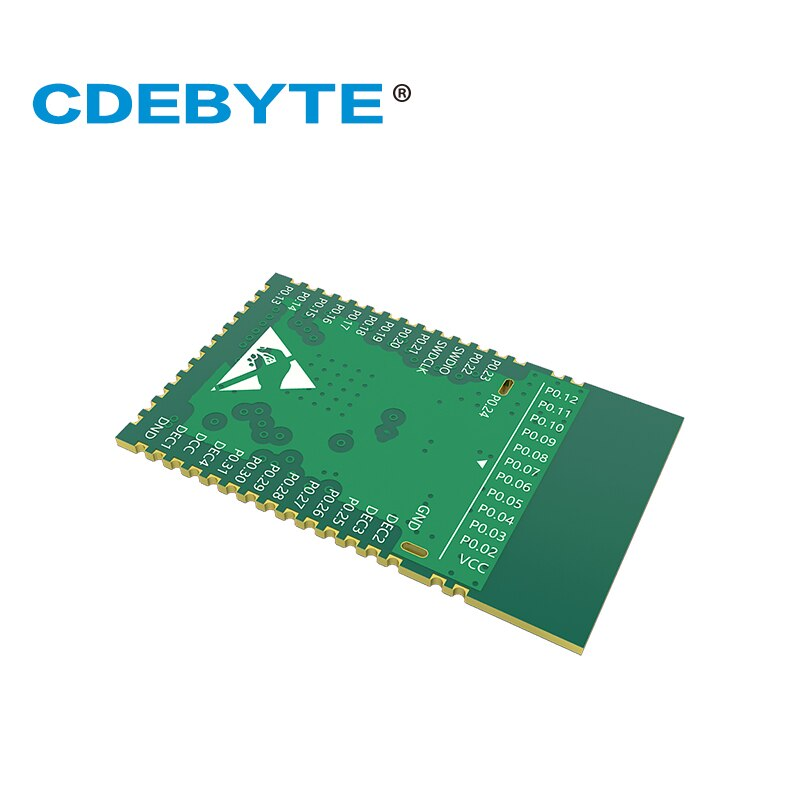

# Kicad_NRF_Adaper
PCB adapter for NRF52832 using Kicad

Project updated to version 2.0 

Please wait for bug status of the hardware.

Project made possible by the help of Dr. Peter Dalmaris with his Udemy course "KiCad Like a Pro 2nd edition". This course is highly recommended.

PCB front side:

PCB back side:

Module front:

Module back:

